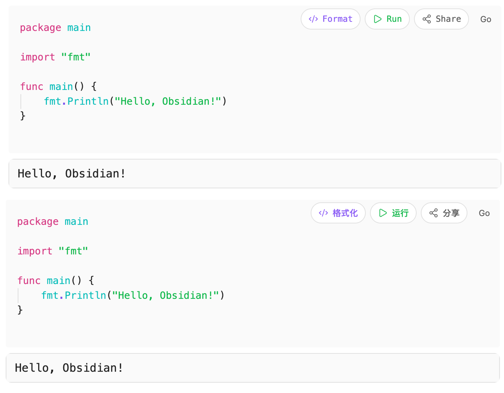
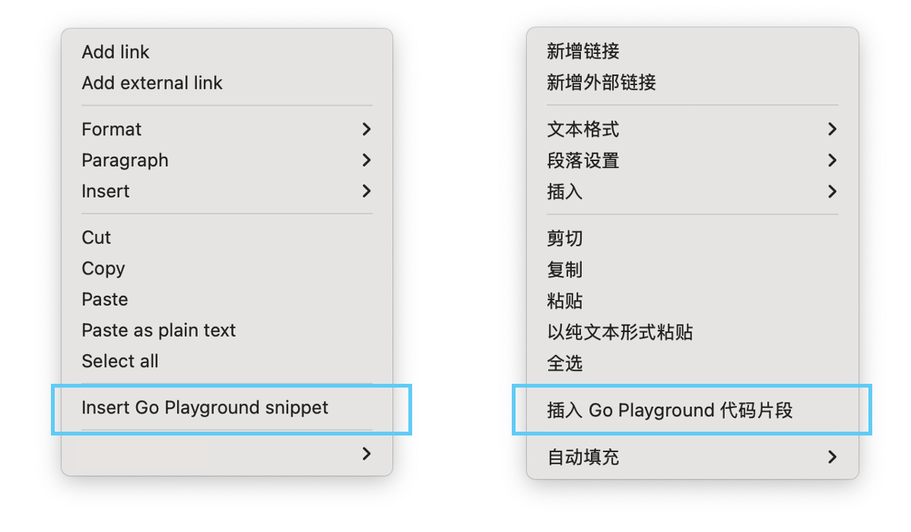
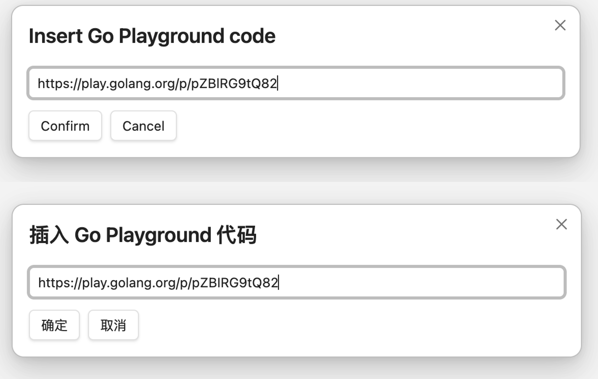

# Go Playground for Obsidian

Run and share Go code directly in Obsidian.

在 Obsidian 中直接运行和分享 Go 代码。

## Features / 功能

- Run Go code blocks / 运行 Go 代码块
- Format Go code / 格式化 Go 代码
- Insert code via share links / 通过分享链接插入代码
- Customizable API URL / 自定义 API 地址以使用第三方 Go Playground
- Multi-language support: English, 简体中文, 繁體中文 / 多语言支持

## Installation / 安装

### From Obsidian Community Plugins / 通过社区插件

Search for "Go Playground" in **Settings → Community plugins → Browse**.

在 **设置 → 社区插件 → 浏览** 中搜索 "Go Playground"。

### Manual Installation / 手动安装

1. Download `main.js`, `manifest.json`, and `styles.css` from the latest release.  
   从最新 release 下载 `main.js`、`manifest.json` 和 `styles.css`。

2. Copy them to `<vault>/.obsidian/plugins/go-playground/`.  
   复制到 `<vault>/.obsidian/plugins/go-playground/`。

3. Reload Obsidian and enable the plugin in **Settings → Community plugins**.  
   重新加载 Obsidian 并在 **设置 → 社区插件** 中启用。

## Usage / 使用

### Run code / 运行代码

Create a Go code block in Markdown and click the **Run** button to view output.

在 Markdown 中创建 Go 代码块，点击 **运行** 按钮查看输出。

**Example / 示例**:

````go
package main

import "fmt"

func main() {
    fmt.Println("Hello, Obsidian!")
}
````



### Insert shared code / 插入分享代码

Right-click in editor and select **Insert Go Snippet**, then paste a Go Playground URL (e.g., `https://play.golang.com/p/xxx`) or snippet ID to import code.

右键菜单选择 **插入 Go 代码段**，粘贴 Go Playground 链接（如 `https://play.golang.com/p/xxx`）或 snippet ID 导入代码。




## Configuration / 配置

**Settings → Go Playground / 设置 → Go Playground**

- **Base URL**: API endpoint, defaults to `https://play.golang.org` / API 地址，默认 `https://play.golang.org`

## Privacy & Terms / 隐私与服务条款

By default, this plugin executes, formats, or shares code via `https://play.golang.org`. By using this plugin, you agree to the terms of service of Go Playground.

Network requests are only sent when you click run or insert buttons. Code is executed via the configured API. No vault data is collected.

在默认设置下，本插件通过 `https://play.golang.org` 运行、格式化或分享代码。使用前请确认您同意 Go Playground 的服务条款。

仅在点击运行或插入按钮时发送网络请求。代码通过配置的 API 执行，不会收集或上传笔记内容。

## Development / 开发

### Requirements / 环境要求

- Node.js 18+ (LTS recommended) / Node.js 18+ (推荐使用 LTS 版本)
- npm / npm

### Setup / 环境准备

```bash
npm install
```

### Build / 构建

```bash
# Development mode with watch / 开发模式（自动重新编译）
npm run dev

# Production build / 生产构建
npm run build
```

### Testing / 测试

1. Build the plugin / 构建插件
2. Copy `main.js`, `manifest.json`, and `styles.css` to a test vault's plugin folder  
   将构建产物复制到测试 vault 的插件文件夹
3. Reload Obsidian / 重新加载 Obsidian

### Contributing / 贡献

Issues and pull requests are welcome. 

欢迎提交 Issue 和 Pull Request。

## License / 许可证

GPLv3
